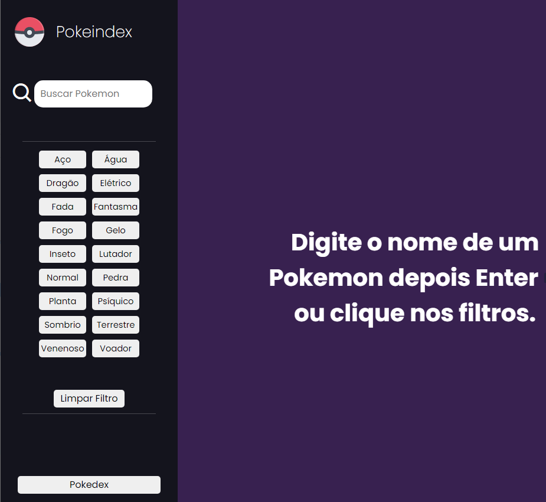
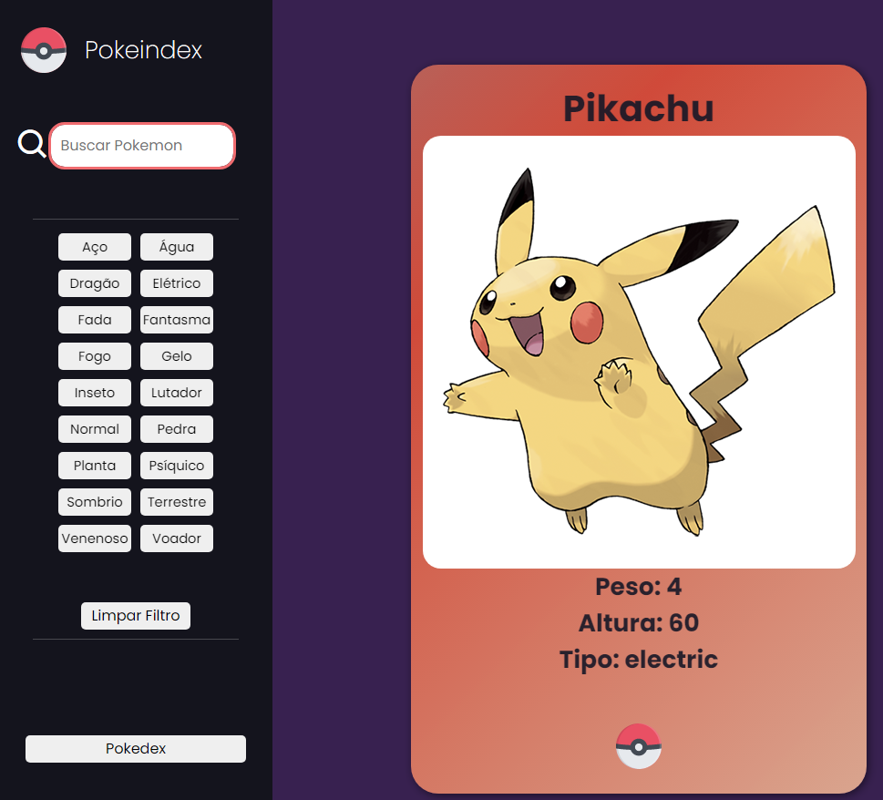
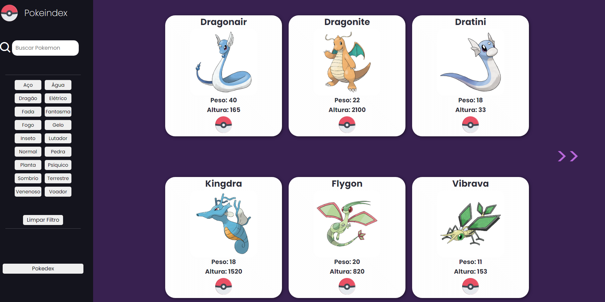
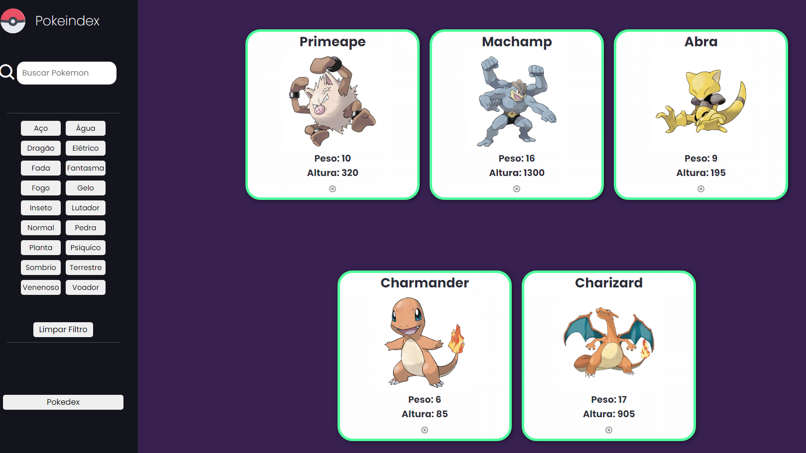

<h1 align="center">POKEINDEX</h1>

 🚀 Estudo consumindo API (PokeAPI) com AXIOS

<h1 align="center"></h1>

•
 <a href="#objetivo">Objetivo</a> •
 <a href="#tecnologias">Tecnologias</a> • 
 <a href="#autor">Autor</a> •

<h1 align="center">
    
    
    
    
    
</h1>

## **Objetivo**

 🔍 Treinar requisições em API e armazenamento no Local Storage 

## **Tecnologias**

<ul>

<li>🛠 HTML
<li>🛠 CSS
<li>🛠 Javascript
<li>🛠 PokeAPI
<li>🛠 AXIOS
<li>🛠 Local Storage

</ul>

## **Autor**

 Desenvolvido por <a href="https://github.com/valtercfjunior">Valter Junior</a> 
